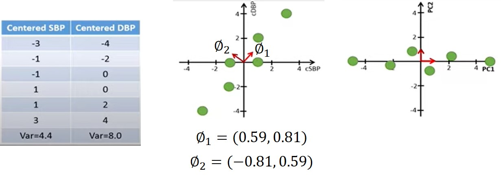

```{r initial, echo = FALSE, cache = FALSE, results = 'hide'}
library(knitr)
library(xaringanExtra)
library(magrittr)
library(reactable)

options(htmltools.dir.version = FALSE, tibble.width = 60, tibble.print_min = 6)
opts_chunk$set(
  echo = FALSE, 
  warning = FALSE, 
  message = FALSE, 
  comment = "#>",
  #fig.path = 'figure/', 
  cache.path = 'cache/',
  dpi = 300, 
  fig.align = 'center', 
  #fig.width = 6,
  #ig.asp = 0.618,
  #fig.show = 'hold',
  cache = FALSE
  #dev = 'svglite'
)

```

```{r xaringan-panelset, echo=FALSE}
xaringanExtra::use_panelset()
```

# Introduction

This chapter introduces a diverse set of unsupervised learning techniques

- Principal Components Analysis
- Clustering

---

# 12.1 The Challenge of Unsupervised Learning

.pull-left[
Unsupervised learning is often performed as part of an exploratory data analysis.

Given a set of $p$ features $X_1,X_2, . . . ,X_p$ measured on $n$ observations, find interesting groups about these features.

Interesting groups include
 - Finding subgroups among the variables
 - Finding subgroups among the observation
 ]
 
.pull-right[
```{r echo = FALSE, out.width="100%"}

```
]

However, there is no clear criteria to determine if a group is interesting or not as it is subjective.

Image from https://www.sciencedirect.com/science/article/pii/S1532046415001380
---

# 12.2 Principal Components Analysis (PCA)

When we have a large set of (preferably correlated) features $X_1,X_2,...,X_p$, PCA helps to summarise them into a smaller number of representative variables (called principal component) $Z_1,Z_2, . . . ,Z_M$, where $M < p$ that helps to explain most of the variability in the original set. $Z_1,Z_2,...,Z_M$ are also called principal components.

```{r echo = FALSE, out.width="70%"}

```

---

# 12.2.1 What Are Principal Components?

Given a $n$ by $p$ data set $X$, with all $p$ variable to have mean $0$,

a principal component $Z_j$, for $1 \le j \le M$, must be expressed in terms of its features $X_1, X_2,..., X_p$ and loadings $\phi_{1j}, \phi_{2j}, ... , \phi_{pj}$ in the following (linear combination) way

$$Z_j = \phi_{1j}X_1 + \phi_{2j}X_2 + ... + \phi_{pj}X_p$$

where the sum of loading squares add up to one or  $\sum_{k=1}^{p}(\phi_{kj})^2 = 1$.

```{r echo = FALSE, out.width="50%"}

```

---

# 12.2.1 What Are Principal Components?

These $M$ loadings make up the principal component loading vector/direction, $\phi_{j} = (\phi_{1j}, \phi_{2j}, . . ., \phi_{pj})^{T}$. 

```{r echo = FALSE, out.width="70%"}

```

Images from [TileStats youtube video](https://www.youtube.com/watch?v=S51bTyIwxFs)

---

# 12.2.1 What Are Principal Components?

.pull-left[
The loading vector $\phi_{j}$ is used to calculate the scores $z_{ij}$ for $1 \le i \le n$, $1 \le j \le M$ for each principal component $Z_j$.

$$Z_j = (z_{1j},z_{2j},...,z_{ij},...,z_{nj})^T$$
where $z_{ij}$ is the sum of the products of the loadings and the individual data values

$$z_{ij} = \sum_{k=1}^{p}(\phi_{kj}x_{ik}) = \phi_{1j}x_{i1}  + \phi_{2j}x_{i2} + ...+ \phi_{pj}x_{ip}$$

Images from [TileStats youtube video](https://www.youtube.com/watch?v=S51bTyIwxFs)
]

.pull-right[
```{r echo = FALSE, out.width="75%"}

```
]

---

# 12.2.1 What Are Principal Components?

Each principal component loadings $\phi_{j} = (\phi_{1j}, \phi_{2j}, . . ., \phi_{pj})^{T}$ is optimised such that

$$\underset{{\phi_{1j},...,\phi_{pj}}}{\text{maximize}\space} \{ \frac{1}{n} \sum_{i=1}^{n}( \sum_{k=1}^{p}(\phi_{kj}x_{ik}))^2 \}  \space \text{subject to} \sum_{k=1}^{p}(\phi_{kj})^2 = 1$$ 

where $\sum_{k=1}^{p}(\phi_{kj}x_{ik}) = z_{ij}$ are the scores in the principal component $Z_j$.

As the mean of the scores $z_{ij}$ is $0$, $\frac{1}{n} \sum_{i=1}^{n}(z_{ij} - 0)^2$ is the sample variance of the scores in the principal component $Z_j$.


```{r echo = FALSE, out.width="60%"}

```

Images from [TileStats youtube video](https://www.youtube.com/watch?v=S51bTyIwxFs)

---

# 12.2.2 Another Interpretation

Principal components provide low-dimensional linear surfaces that are closest to the $n$ observations.

The first principal component loading vector $\phi_{1} = (\phi_{11}, \phi_{21}, . . ., \phi_{p1})^{T}$ is the line in $p$-dimensional space that is closest to the $n$ observations.

```{r echo = FALSE, out.width="60%"}

```

---

# 12.2.2 Another Interpretation

The first two principal component loading vector $\phi_{1}$ and $\phi_{2}$ is the 2D plane in $p$-dimensional space that best fit the $n$ observations.

```{r echo = FALSE, out.width="50%"}

```

---

# 12.2.2 Another Interpretation

By a special property of the loading matrix $\phi^-1 = \phi^T$ and when $M = min(p,n-1)$, it is possible to express each dataset in terms of principal component scores and loadings or $x_{ij} = \sum_{k=1}^{p}(z_{ik}\phi_{kj})$

```{r echo = FALSE, out.width="80%"}

```

---

# 12.2.2 Another Interpretation

However for $m < p$, $x_{ij} \approx \sum_{k=1}^{p}(z_{ik}\phi_{kj})$

```{r echo = FALSE, out.width="60%"}

```

$x_{ij} - \sum_{k=1}^{p}(z_{ik}\phi_{kj})$ will get smaller as $M$ gets closer to $min(p,n-1)$


---

# 12.2.3 The Proportion of Variance Explained

Variance represents how much information for a given data is loss as a result by projecting the observations onto the first few principal components. We define some parameters.

The total variance present in a data set (assuming that the variables have mean $0$) is

$$\sum_{j=1}^{p}Var(X_j) = \sum_{j=1}^{p} (\frac{1}{n}\sum_{i=1}^{n}(x_{ij} - 0)^{2})$$
The variance explained by the $m$th principal component is the variance of the scores (which also has the mean of $0$).

$$\frac{1}{n}\sum_{i=1}^{n}z_{im}^2 = \frac{1}{n}\sum_{i=1}^{n}(\sum_{j=1}^{p}\phi_{jm}x_{ij})^{2}$$
---

# 12.2.3 The Proportion of Variance Explained

```{r echo = FALSE, out.width="80%"}

```

Images from [TileStats youtube video](https://www.youtube.com/watch?v=S51bTyIwxFs)

---

# 12.2.3 The Proportion of Variance Explained

The proportion of variance explained $(PVE)$ by the $m$th principal component

$$PVE_m = \frac{Variance\space explained\space by\space the\space mth\space principal\space component\space}{Total\space variance\space present\space in\space a\space data\space set\space} = \frac{\frac{1}{n}\sum_{i=1}^{n}z_{im}^2}{\frac{1}{n}\sum_{i=1}^{n}\sum_{j=1}^{p}(x_{ij})^{2}}$$
```{r echo = FALSE, out.width="50%"}

```

Images from [TileStats youtube video](https://www.youtube.com/watch?v=S51bTyIwxFs)

---

# 12.2.3 The Proportion of Variance Explained

The variance of the data can also be decomposed into the variance of the $M$ principal components plus the mean squared error of this $M$-dimensional approximation.

$$\underbrace{\frac{1}{n}\sum_{i=1}^{n}\sum_{j=1}^{p}(x_{ij})^{2}}_\text{Var. of data} =  \underbrace{\frac{1}{n}\sum_{i=1}^{n}\sum_{m=1}^{M}(z_{ik})^{2}}_\text{Var. of first M PCs} +
\underbrace{\frac{1}{n}\sum_{i=1}^{n}\sum_{j=1}^{p}(x_{ij}-\sum_{m=1}^{M}z_{im}\phi_{jm})^{2}}_\text{MSE of M-dimensional approximation}$$

```{r echo = FALSE, out.width="60%"}
knitr::include_graphics("img/variance_decomposition.jpg")
```

Images from [TileStats youtube video](https://www.youtube.com/watch?v=S51bTyIwxFs)

---

# 12.2.3 The Proportion of Variance Explained

$$\underbrace{\frac{1}{n}\sum_{i=1}^{n}\sum_{j=1}^{p}(x_{ij})^{2}}_\text{Var. of data} =  \underbrace{\frac{1}{n}\sum_{i=1}^{n}\sum_{m=1}^{M}(z_{im})^{2}}_\text{Var. of first M PCs} +
\underbrace{\frac{1}{n}\sum_{i=1}^{n}\sum_{j=1}^{p}(x_{ij}-\sum_{m=1}^{M}z_{im}\phi_{jm})^{2}}_\text{MSE of M-dimensional approximation}$$

Bring $\underbrace{\frac{1}{n}\sum_{i=1}^{n}\sum_{j=1}^{p}(x_{ij}-\sum_{m=1}^{M}z_{im}\phi_{jm})^{2}}_\text{MSE of M-dimensional approximation}$ to the left hand side

$$\underbrace{\frac{1}{n}\sum_{i=1}^{n}\sum_{j=1}^{p}(x_{ij})^{2}}_\text{Var. of data} - \underbrace{\frac{1}{n}\sum_{i=1}^{n}\sum_{j=1}^{p}(x_{ij}-\sum_{m=1}^{M}z_{im}\phi_{jm})^{2}}_\text{MSE of M-dimensional approximation} =  \underbrace{\frac{1}{n}\sum_{i=1}^{n}\sum_{m=1}^{M}(z_{im})^{2}}_\text{Var. of first M PCs}$$
---

# 12.2.3 The Proportion of Variance Explained

$$\underbrace{\frac{1}{n}\sum_{i=1}^{n}\sum_{j=1}^{p}(x_{ij})^{2}}_\text{Var. of data} - \underbrace{\frac{1}{n}\sum_{i=1}^{n}\sum_{j=1}^{p}(x_{ij}-\sum_{m=1}^{M}z_{im}\phi_{jm})^{2}}_\text{MSE of M-dimensional approximation} =  \underbrace{\frac{1}{n}\sum_{i=1}^{n}\sum_{m=1}^{M}(z_{im})^{2}}_\text{Var. of first M PCs}$$

Divide by $\underbrace{\frac{1}{n}\sum_{i=1}^{n}\sum_{j=1}^{p}(x_{ij})^{2}}_\text{Var. of data} \neq 0$ on both side

$$1 - \frac{\sum_{i=1}^{n}\sum_{j=1}^{p}(x_{ij}-\sum_{m=1}^{M}z_{im}\phi_{jm})^{2}}{\sum_{i=1}^{n}\sum_{j=1}^{p}(x_{ij})^{2}} = \frac{\frac{1}{n}\sum_{i=1}^{n}\sum_{m=1}^{M}(z_{im})^{2}}{\frac{1}{n}\sum_{i=1}^{n}\sum_{j=1}^{p}(x_{ij})^{2}} = \sum_{m=1}^{M} \frac{\frac{1}{n}\sum_{i=1}^{n}(z_{im})^{2}}{\frac{1}{n}\sum_{i=1}^{n}\sum_{j=1}^{p}(x_{ij})^{2}}$$
Recall that $PVE_m = \frac{Variance\space explained\space by\space the\space mth\space principal\space component\space}{Total\space variance\space present\space in\space a\space data\space set\space} = \frac{\frac{1}{n}\sum_{i=1}^{n}z_{im}^2}{\frac{1}{n}\sum_{i=1}^{n}\sum_{j=1}^{p}(x_{ij})^{2}}$

---

# 12.2.3 The Proportion of Variance Explained

We have 

$$1 - \frac{\sum_{i=1}^{n}\sum_{j=1}^{p}(x_{ij}-\sum_{m=1}^{M}z_{im}\phi_{jm})^{2}}{\sum_{i=1}^{n}\sum_{j=1}^{p}(x_{ij})^{2}} = \sum_{m=1}^{M} \frac{\frac{1}{n}\sum_{i=1}^{n}(z_{im})^{2}}{\frac{1}{n}\sum_{i=1}^{n}\sum_{j=1}^{p}(x_{ij})^{2}} = \sum_{m=1}^{M}PVE_m$$
Using $TSS$ as the total sum of squared elements of $X$, and $RSS$ as the residual sum of squares of the M-dimensional approximation given by the $M$ principal components.

$$ \sum_{m=1}^{M}PVE_m = 1 - \frac{RSS}{TSS} = R^2$$

We can interpret the cumulative PVE as the $R^2$ of the approximation for $X$ given by the first $M$ principal components

---

# 12.2.4 More on PCA

Why do we need to scale the variables have standard deviation one ?

```{r echo = FALSE, out.width="60%"}

```

---

# 12.2.4 More on PCA

Each principal component loading vector is unique, up to a sign flip or 

Given $j$ and $j'$, $\phi_{j'm} = k\phi_{jm}$ where $k$ = $1$ or $-1$.

```{r echo = FALSE, out.width="100%"}

```

---

# 12.2.4 More on PCA

How many principal components is enough ? Typically decided using the scree plot though it can be subjective.

```{r echo = FALSE, out.width="60%"}

```

---

# 12.3 Missing Values and Matrix Completion

It is possible for datasets to have missing values. Unfortunately, the statistical learning methods that we have seen in this book cannot handle missing values. 

We could remove data with missing values but it is wasteful.

Another way is set the missing $x_{ij}$ to be the mean of the $j$th column.

Although this is a common and convenient strategy, often we can do better by exploiting the correlation between the variables by using principal components.

---

# 12.3 Missing Values and Matrix Completion

.panelset[
.panel[.panel-name[Full Data]

.pull-left[
```{r, eval=FALSE, echo=TRUE}
data <- data.frame(
  SBP = c(-3,-1,-1, 1, 1, 3),
  DBP = c(-4,-2, 0, 0, 2, 4))
```
]
.pull-right[
```{r, echo=FALSE}
data <- data.frame(
  SBP = c(-3,-1,-1, 1, 1, 3),
  DBP = c(-4,-2, 0, 0, 2, 4))
data %>%
  reactable::reactable(defaultPageSize = 6)
```
]
]

.panel[.panel-name[Missing Data]
.pull-left[
```{r, eval=FALSE, echo=TRUE}
missing_data <- data.frame(
  SBP = c(-3, NA, -1, 1, 1, NA),
  DBP = c(NA, -2, 0, NA, 2, 4)
)
```
]
.pull-right[
```{r, echo=FALSE}
missing_data <- data.frame(
  SBP = c(-3, NA, -1, 1, 1, NA),
  DBP = c(NA, -2, 0, NA, 2, 4)
)
missing_data %>%
  reactable::reactable(defaultPageSize = 6)
```
]
]

.panel[.panel-name[Initialisation]
Fill in the missing values with these mean values.
Mean of SBP is $-0.5$, Mean of DBP is $1$.
.pull-left[
```{r, eval=FALSE, echo=TRUE}
initialisation_data <- data.frame(
  SBP = c(-3, -0.5, -1, 1, 1, -0.5),
  DBP = c(1, -2, 0, 1, 2, 4)
)
```
]
.pull-right[
```{r, echo=FALSE}
initialisation_data <- data.frame(
  SBP = c(-3, -0.5, -1, 1, 1, -0.5),
  DBP = c(1, -2, 0, 1, 2, 4)
)
initialisation_data %>%
  reactable::reactable(defaultPageSize = 6)
```
]
]
]

---

# 12.3 Missing Values and Matrix Completion

.panelset[
.panel.panel[.panel-name[Iteration 1 Data]
.pull-left[
```{r, eval=FALSE, echo=TRUE}
initialisation_data <- data.frame(
  SBP = c(-3, -0.5, -1, 1, 1, -0.5),
  DBP = c(1, -2, 0, 1, 2, 4)
)
```
]
.pull-right[
```{r, echo=FALSE}
initialisation_data <- data.frame(
  SBP = c(-3, -0.5, -1, 1, 1, -0.5),
  DBP = c(1, -2, 0, 1, 2, 4)
)
initialisation_data %>%
  reactable::reactable(defaultPageSize = 6)
```
]
]
.panel.panel[.panel-name[Loadings Inverse]
.pull-left[
```{r, eval=FALSE, echo=TRUE}
initialisation_data_pca <- 
  prcomp(initialisation_data)

initialisation_data_loadings <- 
  initialisation_data_pca$rotation
```

```{r, eval=FALSE, echo=TRUE}
initialisation_data_loadings_inverse <- 
  solve(initialisation_data_loadings)["PC1",,drop = FALSE]
```
]
.pull-right[
```{r, echo=FALSE}
initialisation_data_pca <- 
  prcomp(initialisation_data)

initialisation_data_loadings <- 
  initialisation_data_pca$rotation

initialisation_data_loadings %>%
  reactable::reactable(
    defaultPageSize = 2,
    columns = list(
      PC1 = reactable::colDef(format = reactable::colFormat(digits = 2)),
      PC2 = reactable::colDef(format = reactable::colFormat(digits = 2))
    )
    )
```
<br>
<br>
```{r, echo=FALSE}
initialisation_data_loadings_inverse <- 
  solve(initialisation_data_loadings)["PC1",,drop = FALSE]

initialisation_data_loadings_inverse %>%
  reactable::reactable(
    defaultPageSize = 2,
    columns = list(
      SBP = reactable::colDef(format = reactable::colFormat(digits = 2)),
      DBP = reactable::colDef(format = reactable::colFormat(digits = 2))
    )
    )
```
]
]
.panel.panel[.panel-name[Scores]
.pull-left[
```{r, eval=FALSE, echo=TRUE}
# initialisation_data_pca <- 
#   prcomp(initialisation_data)

initialisation_data_scores <- 
  initialisation_data_pca$x[,"PC1",drop = FALSE]
```
]
.pull-right[
```{r, echo=FALSE}
initialisation_data_scores <- 
  initialisation_data_pca$x[,"PC1",drop = FALSE]

initialisation_data_scores %>%
  reactable::reactable(
    defaultPageSize = 6,
    columns = list(
      PC1 = reactable::colDef(format = reactable::colFormat(digits = 2))
    )
  )
```
]
]
.panel.panel[.panel-name[Estimated Data]
.pull-left[
```{r, eval=FALSE, echo=TRUE}
estimated_data_1 <- 
  initialisation_data_scores %*% initialisation_data_loadings_inverse
```
]
.pull-right[
```{r, echo=FALSE}
estimated_data_1 <- 
  initialisation_data_scores %*% initialisation_data_loadings_inverse

estimated_data_1 %>%
  reactable::reactable(
    defaultPageSize = 6,
    columns = list(
      SBP = reactable::colDef(format = reactable::colFormat(digits = 2)),
      DBP = reactable::colDef(format = reactable::colFormat(digits = 2))
    )
    )
```
]
]
.panel.panel[.panel-name[Objective]
.pull-left[
```{r, eval=FALSE, echo=TRUE}
objective_1 <- 
  sum((missing_data - estimated_data_1)^2, na.rm = TRUE)
```
]
.pull-right[
```{r, echo=FALSE}
objective_1 <- 
  sum((missing_data - estimated_data_1)^2, na.rm = TRUE)

objective_1
```
]
]
.panel.panel[.panel-name[Iteration 2 Data]
.pull-left[
```{r, eval=FALSE, echo=TRUE}
data <- data.frame(
  SBP = c(-3,-1,-1, 1, 1, 3),
  DBP = c(-4,-2, 0, 0, 2, 4))

missing_data <- data.frame(
  SBP = c(-3, NA, -1, 1, 1, NA),
  DBP = c(NA, -2, 0, NA, 2, 4)
)

iteration_2_data <- data.frame(
  SBP = c(-3, -0.61, -1, 1, 1, 0.61),
  DBP = c(-0.51, -2, 0, 0.3, 2, 4)
)
```
]
.pull-right[
```{r, echo=FALSE}
iteration_2_data <- data.frame(
  SBP = c(-3, -0.61, -1, 1, 1, 0.61),
  DBP = c(-0.51, -2, 0, 0.3, 2, 4)
)

iteration_2_data %>%
  reactable::reactable(
    defaultPageSize = 6,
    columns = list(
      SBP = reactable::colDef(format = reactable::colFormat(digits = 2)),
      DBP = reactable::colDef(format = reactable::colFormat(digits = 2))
    )
    )
```
]
]
]

---

# 12.4 Clustering Methods

Clustering is to split into distinct homogeneous groups such that 
 * Observations within each group are quite similar to each other
 * Observations in different groups are quite different from each other.

In this section we focus on perhaps the two best-known
clustering approaches: 
* K-means Clustering
* Hierarchical Clustering.

---

# 12.4 Clustering Methods

```{r echo = FALSE, out.width="60%"}

```

[Francesco Archetti's slides](https://www.slideserve.com/macy-holden/metodi-numerici-per-la-bioinformatica)

---

# 12.4.1 K-Means Clustering

.pull-left[
An approach to partition a data set into K distinct, non-overlapping clusters.

* $i$ be the number of observations
* $x_i$ and $x_{i'}$ be two different observations
* $j$ be the number of features
]
.pull-right[
To measure how much two observations $x_i$ and $x_{i'}$ are different from each other, the squared Euclidean distance is used

$$\sum_{j=1}^{p}(x_{ij}-x_{i'j})^2$$
```{r echo = FALSE, out.width="100%"}

```
]

---

# 12.4.1 K-Means Clustering

* $k$ be the number of clusters
* $C_k$ be the $k$th cluster

Sum of all of pairwise squared Euclidean distances between the observations in the $k$th cluster

$$\sum_{i,i' \in C_k} (\sum_{j=1}^{p}(x_{ij}-x_{i'j})^2)$$
* $|C_k|$ be the number of samples in the $k$th cluster

The within-cluster variation for cluster $C_k$ denote as $W(C_k)$ is the mean measurement of how much the observations within the cluster $C_k$ differ from each other.

$$W(C_k) = \frac{1}{|C_k|} \sum_{i,i' \in C_k} (\sum_{j=1}^{p}(x_{ij}-x_{i'j})^2)$$
---

# 12.4.1 K-Means Clustering

An approach to partition a data set into K distinct, non-overlapping clusters such that the sum of within-cluster variation is as small as possible.

$$\underset{C_1,...,C_k}{\text{minimize}}\{\sum_{k=1}^{K}W(C_k)\}$$
$$\underset{C_1,...,C_k}{\text{minimize}}\{\sum_{k=1}^{K}\frac{1}{|C_k|} \sum_{i,i' \in C_k} (\sum_{j=1}^{p}(x_{ij}-x_{i'j})^2)\}$$
---

# 12.4.1 K-Means Clustering

Using $k=3$ and $j=2$ as an example, the algorithm starts by randomly assign a cluster number/group $C_1,C_2$ and $C_k$ to each of the observations.

```{r echo = FALSE, out.width="60%"}

```

---

# 12.4.1 K-Means Clustering
.pull-left[
We proceed with iteration 1.

For each cluster group, calculate the cluster's *centroid*. The cluster centroids are computed as the mean of the observations assigned to each cluster.

$$\bar{x}_{k} = \frac{1}{|C_k|} \sum_{i \in C_k}{x_{i}}$$
where $|C_k|$ is the number of observations in cluster $C_k$
]

.pull-right[
```{r echo = FALSE, out.width="60%"}

```
]
---

# 12.4.1 K-Means Clustering
.pull-left[
Next, for each given observation, calculate the distance between the observation and the centroids.

Reassign the given observation to the cluster that corresponds to the shortest distance centroid.

Calculate $\sum_{k=1}^{K}W(C_k)$ for that iteration.
]
.pull-right[
```{r echo = FALSE, out.width="60%"}

```
]

---

# 12.4.1 K-Means Clustering

Repeat the iteration step on the newly assigned clusters until there are minimal changes to $\sum_{k=1}^{K}W(C_k)$.

```{r echo = FALSE, out.width="50%"}

```

---

# 12.4.1 K-Means Clustering

Caveats

* We must decide how many clusters we expect in the data.
* Results obtained will depend on the initial (random) cluster assignment of each observation which may give inconsistent results.

For this reason, it is important to run the algorithm multiple times from different random initial configurations. Then one selects the best solution, i.e. that for which $\sum_{k=1}^{K}W(C_k)$ is the smallest.

Hierarchical clustering is an alternative approach to overcome some of the weaknesses of K-Means Clustering

---

# 12.4.2 Hierarchical Clustering

Hierarchical clustering results in a tree-based representation of the observations, called a dendrogram. Each leaf of the dendrogram represents one observation. Clusters are obtained by cutting the dendrogram at a given height.

```{r echo = FALSE, out.width="60%"}

```

---

# 12.4.2 Hierarchical Clustering

In practice, people often look at the dendrogram and select by eye a sensible number of clusters, based on the heights of the fusion and the number of clusters desired.

```{r echo = FALSE, out.width="60%"}

```

---

# 12.4.2 Hierarchical Clustering

Each leaf of the dendrogram represents one observation. Starting out at the bottom of the dendrogram, each of the $n$ observations is treated as its own cluster.

```{r echo = FALSE, out.width="60%"}

```
---

# 12.4.2 Hierarchical Clustering

The algorithm then measures all possible pairwise distance within the $n$ observations. 

The two observations with the smallest distance is then classified as one cluster, giving a remaining of $``\hspace{0.1cm}n-1"$ observations

```{r echo = FALSE, out.width="100%"}

```

---

# 12.4.2 Hierarchical Clustering

The algorithm continues until all observations are used.

```{r echo = FALSE, out.width="60%"}

```

Height of the blocks represents the distance between clusters.

---

# 12.4.2 Hierarchical Clustering

How did we determine that the cluster $\{p5, p6\}$ should be fused with the cluster $\{p4\}$ ?

```{r echo = FALSE, out.width="60%"}

```

The concept of dissimilarity between a pair of observations needs to be extended to a pair of groups of observations. This extension is achieved by developing the notion of *linkage*,

---

# 12.4.2 Hierarchical Clustering

.pull-left[
Single-linkage: the distance between two clusters is defined as the shortest distance between two points in each cluster

Complete-linkage: the distance between two clusters is defined as the longest distance between two points in each cluster.

Average-linkage: the distance between two clusters is defined as the average distance between each point in one cluster to every point in the other cluster.

Centroid-linkage: finds the centroid of cluster 1 and centroid of cluster 2, and then calculates the distance between the two before merging.
]

.pull-right[
```{r echo = FALSE, out.width="70%"}

```
[Kavana Rudresh GitHub for R-Ladies Philly](https://github.com/kavana-r/RLadies_Hierarchical_Clustering)
]

---

# 12.4.2 Hierarchical Clustering

.pull-left[
[Mustafa Murat's Hierarchical clustering slides](https://mmuratarat.github.io/2020-05-23/hierarchical_clustering)
]

.pull-right[
```{r echo = FALSE, out.width="80%"}
knitr::include_graphics("img/linkages_example.jpg")
```
]

---

# 12.4.2 Hierarchical Clustering

```{r echo = FALSE, out.width="70%"}
knitr::include_graphics("img/figure_12_14.jpg")
```

---

# 12.4.2 Hierarchical Clustering

```{r echo = FALSE, out.width="70%"}

```

---

# 12.4.3 Practical Issues in Clustering

```{r echo = FALSE, out.width="70%"}

```

[Kavana Rudresh GitHub for R-Ladies Philly](https://github.com/kavana-r/RLadies_Hierarchical_Clustering)

---

# 12.4.3 Practical Issues in Clustering

```{r echo = FALSE, out.width="70%"}
knitr::include_graphics("img/subjective_2.jpg")
```

[Mustafa Murat's Hierarchical clustering slides](https://mmuratarat.github.io/2020-05-23/hierarchical_clustering)

---

# 12.4.2 Hierarchical Clustering

Different dissimilarity measure gives different clusters.

```{r echo = FALSE, out.width="60%"}

```

---

# 12.4.3 Practical Issues in Clustering

Should the observations or features be standardized to have standard deviation of one ?

In the case of hierarchical clustering,
* What dissimilarity measure should be used ?
* What type of linkage should be used ?
* Where should we cut the dendrogram in order to obtain clusters ?

In the case of K-means clustering, 
* How many clusters should we look for in the data ?

---

# 12.4.3 Practical Issues in Clustering

Kmeans and hierarchical clustering force every observation into a cluster, the
clusters found may be heavily distorted due to the presence of outliers that do not belong to any cluster.

Clustering methods generally are not very robust to perturbations to the data. We recommend clustering subsets of the data in order to get a sense of the robustness of the clusters obtained.
